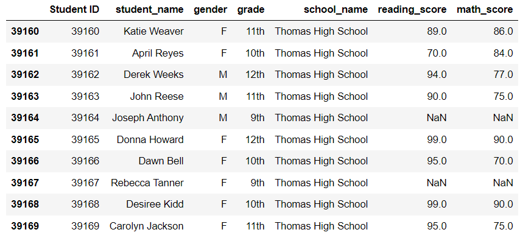
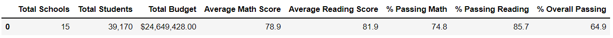

# School_District_Analysis.

## Overview of Project
Analyzing the school disrict greads in order to find the top schools and the buttem scoll and understend what affect the school grades.

### Purpose
Using the Student complete dataset to understend the difrent schools achivments. 

## Challenges and Selotions
The school board think the Student complete file shows evidence of academic dishonesty in orger to solve this we ajested the nath and reading scours for Thomas High School, 9th grede student to NaN, so this date will not affect the total scores.   

#### The reading and math scores for the ninth graders in Thomas High school are replaced with NaNs

## Results

   The district summary DataFrame 

- The school summary DataFrame
![per_school_summary_df_after replace _THS_9th_grade.png(Resources/per_school_summary_df_after replace _THS_9th_grade.png)

The top 5 performing schools, based on the overall passing rate
The bottom 5 performing schools, based on the overall passing rate 
The average math score for each grade level from each school 
The average reading score for each grade level from each school 
The scores by school spending per student 
The scores by school size 
The scores by school type

