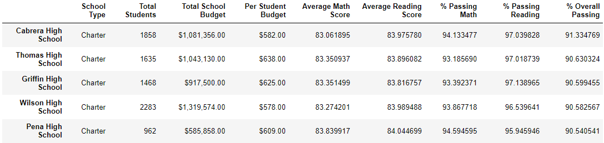
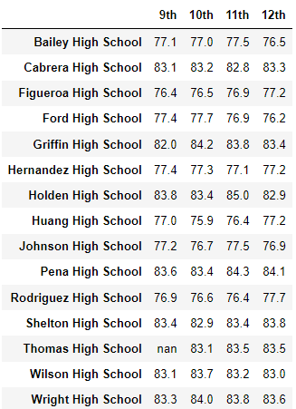
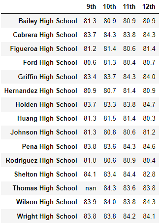
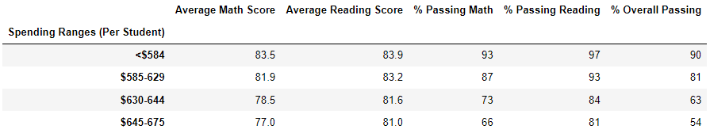
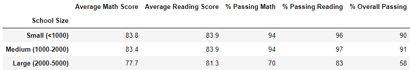
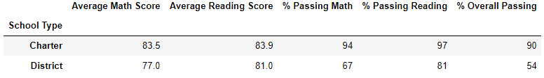

# School_District_Analysis.

## Overview of Project
Analyzing the school district grades in order to find the top schools and the bottom school and understand what affect the school grades.

### Purpose
Using the Student complete dataset to understand the different schools' achievements. 

## Challenges and Solutions
The school board thinks the Student's complete file shows evidence of academic dishonesty in order to solve this we adjusted the math and reading scours for Thomas High School, 9th-grade students to NaN, so this data will not affect the total scores.   

#### The reading and math scores for the ninth graders in Thomas High school are replaced with NaNs

## Results

 - The district summary DataFrame 

 By replacing Thomas High School, the 9th-grade score we can see the district summary scouts have a minor decrease.
 Because we replaced only Thomas High School scores it affects the scores of Thomas High School in the school summary which affects the school's total scores.

- The top 5 performing schools, based on the overall passing rate

 We can see that Thomas High School is still in the top 5 high schools, the 9th grade has a small effect on the school total score.

- The average math score (left) and reading score (right) for each grade level from each school.

 Replacing the ninth-grade scores affects the Math and Reading overall score for 9th grade.

- The scores by school spending per student 

 The spending per student didn't change bur the scoures has a samll decrease. 

- The scores by school size 

 The school size didn't change but the scoures has a samll decrease. 

- The scores by school type

 The scores by school type has a samll decrease. 

## Summary: 
Changes in the updated school district analysis after reading and math scores for the ninth grade at Thomas High School have been replaced with NaNs
1. The average Math and Reading scoure
2. Precent of Math pasing dicreises by last than a point 
3. Precent of Reading pasing dicreises by last than a point
4. Precent of overall pasing dicreises by last than a point

Beacouse the ninth grade at Thomas High School in only 0.01% of the total stuodant the changes we see are mainor.  
